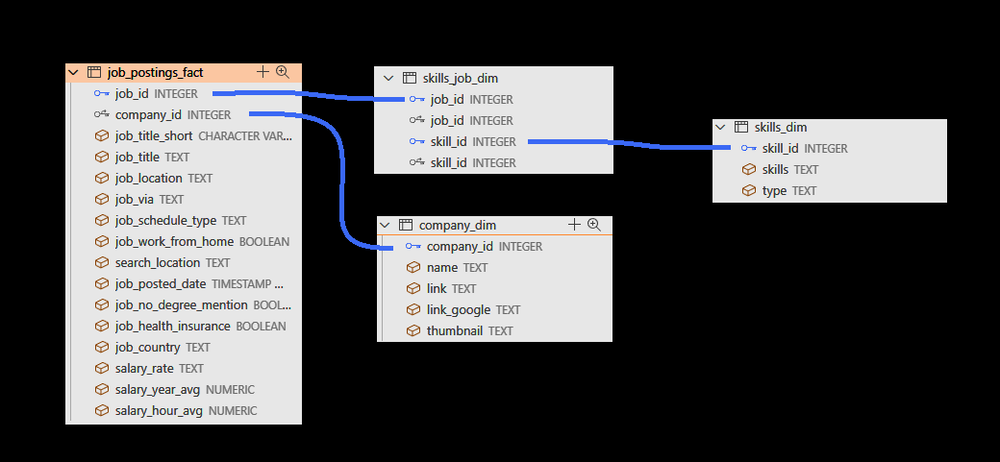
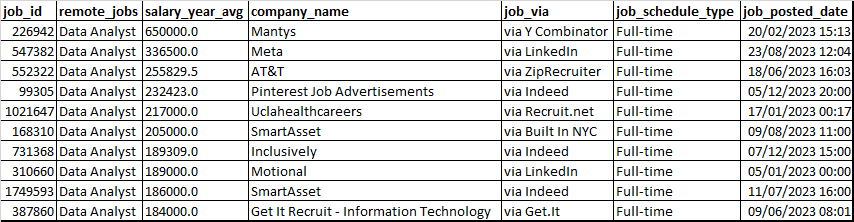
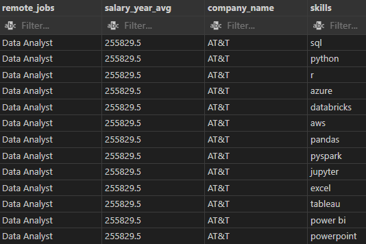
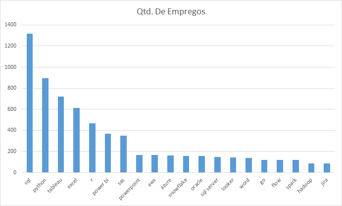
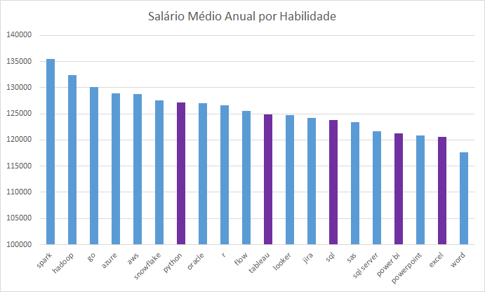
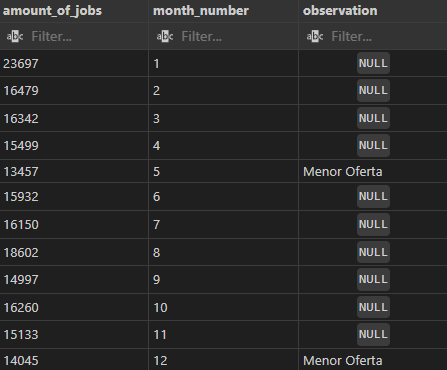

# Introdução
Esse projeto de manutenção e seleção de informações de bases de dados tem como principal objetivo explorar a maior linguagem de consulta existente (SQL).

Aqui, teremos uma tabela com várias colunas de informações a respeito de empregos na área de ciência de dados. Essas informações foram coletadas de diversos sites na internet durante o ano de 2023. Há uma tabela principal e três tabelas secundárias ligadas por chaves estrangeiras da seguinte maneira:



# Ferramentas que Usei
- Usei principalmente ***SQL*** para fazer as consultas, juntar tabelas, selecionar informações, etc.
- Usei ***GIT/GitHub*** para subir meu projeto para o repositório e torná-lo público, facilitando assim o acesso de todos.
- Usei ***VS Code*** como ambiente de desenvolvimento integrado para programar praticamente todos os códigos executados.
- Usei ***PostgreSQL*** como base de dados para armazenar e organizar as tabelas.
- Usei ***Excel*** para limpar e visualizar os dados coletados.

# A Análise
Cada consulta feita nesse projeto tem o objetivo de selecionar informações relevantes na hora de escolher a carreira a ser seguida na área de ciência de dados. O principal foco foi na função "Analista de Dados".

1 - Primeiramente, uma consulta simples para testar o aprendizado das principais funções dentro da linguagem. O objetivo era localizar as maiores ofertas de salário dentro da função de analista de dados em formato de emprego remoto. As informações deveriam também incluir o site para cadastro, o tipo de rotina de trabalho e a data na qual a oferta foi postada. Isso foi executado através do simples código:

```sql
SELECT
job_id,
job_title_short AS remote_jobs,
salary_year_avg,
company_dim.name AS company_name,
job_via,
job_schedule_type,
job_posted_date
FROM
    job_postings_fact
LEFT JOIN company_dim ON job_postings_fact.company_id = company_dim.company_id
WHERE
    job_work_from_home = TRUE
    AND salary_year_avg IS NOT NULL
    AND job_title_short = 'Data Analyst'
ORDER BY
    salary_year_avg DESC
LIMIT 10
```
O resultado apresentará a seguinte tabela:



2 - Em seguida, teremos o objetivo de saber quais são as habilidades necessárias para a maior oferta de salário (onde essas habilidades são citadas). Campos comentados não são necessários.

```sql
WITH skill_set AS (
    SELECT
        skill_id,
        skills_dim.skills
    FROM
        skills_dim
)

SELECT
    -- job_id,
    job_title_short AS remote_jobs,
    salary_year_avg,
    company_dim.name AS company_name,
    skill_set.skills
    -- job_via,
    -- job_schedule_type,
    -- job_posted_date
FROM
    job_postings_fact
LEFT JOIN company_dim ON job_postings_fact.company_id = company_dim.company_id
INNER JOIN skills_job_dim ON job_postings_fact.job_id = skills_job_dim.job_id
INNER JOIN skill_set ON skills_job_dim.skill_id = skill_set.skill_id
WHERE
    job_work_from_home = TRUE
    AND salary_year_avg IS NOT NULL
    AND job_title_short = 'Data Analyst'
ORDER BY
    salary_year_avg DESC
LIMIT 13
```
Esse código puxará a tabela a seguir:



3 - As habilidades exigidas para a maior oferta não são necessariamente as mais exigidas no mercado em geral. Em seguida, devemos selecionar as habilidades agrupadas por quantidade de ofertas de trabalho em ordem decrescente. Ainda, devemos selecionar a média salarial por habilidade como informação adicional.

```sql
SELECT
    COUNT(job_postings_fact.job_id) AS job_amount,
    ROUND(AVG(salary_year_avg), 2) AS average_wage,
    skills_dim.skills
FROM
    job_postings_fact
LEFT JOIN skills_job_dim ON job_postings_fact.job_id = skills_job_dim.job_id
LEFT JOIN skills_dim ON skills_job_dim.skill_id = skills_dim.skill_id
WHERE
    job_title_short = 'Data Analyst'
    AND skills_dim.skills IS NOT NULL
    AND salary_year_avg >= 100000
GROUP BY
    skills_dim.skills
HAVING
    COUNT(job_postings_fact.job_id) >= 20
ORDER BY
    job_amount DESC
    -- average_wage DESC
LIMIT 18
```
Com o seguinte código, se alternarmos a função ORDER BY entre salário e ofertas de emprego, teremos duas tabelas (obs: as colunas roxas na segunda correspondem às habilidades de maior oferta na primeira):




Temos então a conclusão das nossas suspeitas: As habilidades de maior demanda não são necessariamente as que mais bem pagam. Porém, são extremamente importantes para construir a própria carreira de analista de dados, evoluir profissionalmente e usar essas oportunidades de emprego para aprender coisas novas e consolidar as habilidades que já foram aprendidas.

Por último, mais a título de aprendizado, vamos separar as quantidades de ofertas por mês na função de analista de dados e destacar os dois meses de menor oferta após a visualização da tabela. Aqui, exploraremos o uso de EXTRACT e CASE WHEN através do simples código:

```sql
SELECT
    COUNT(job_id) AS amount_of_jobs,
    EXTRACT(MONTH FROM job_posted_date) AS month_number,
    CASE
        WHEN EXTRACT(MONTH FROM job_posted_date) = '5'
            THEN 'Menor Oferta'
        WHEN EXTRACT(MONTH FROM job_posted_date) = '12'
            THEN 'Menor Oferta'
    END AS observation
FROM
    job_postings_fact
WHERE
    job_title_short = 'Data Analyst'
GROUP BY
    month_number
ORDER BY
    month_number
```



# O Que Aprendi

Aprendi a selecionar dados usando SQL e visualizá-los usando o Excel. Utilizei de funções como SELECT, FROM, WHERE, GROUP BY, HAVING, ORDER BY, LIMIT, CASE WHEN, LEFT JOIN, INNER JOIN, EXTRACT, COUNT, SUM, AVG, etc.

Aprendi também a interpretar dados de modo a gerar conclusões que poderão ser usadas para futuras análises ou mesmo para tomada de decisões, sejam elas de marketing, administrativas, financeiras, etc.

# Conclusões das Análises

De acordo com dados de várias ofertas de emprego que surgiram durante o ano de 2023, a profissão de analista de dados conta com salários extremamente atraentes, cujas habilidades mais exigidas são SQL, Python, Tableau, Excel, R, Power BI e SAS.

Outras habilidades interessantes também são: Spark, Hadop, GO, Azure e AWS que demonstra a existência da valorização da especialização do analista de dados em algumas partes da sua área, como Engenharia de Cloud, back-end ou DevOps.